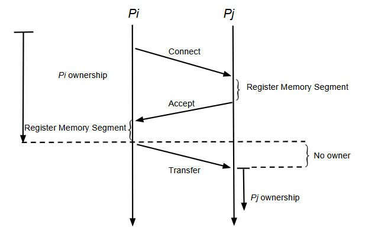

---

##### Download

+ [Paper](https://www.usenix.org/system/files/conference/hotcloud18/hotcloud18-paper-memon.pdf)

---

##### Abstract

RDMA can be used to implement a shared storage abstraction for distributed applications.
We argue that for loosely coupled applications, such an approach is overkill.
For such applications, we propose RaMP, a much lighter weight alternative.
RaMP uses RDMA only to support occasional coordination operations.
We use a load balancing example to show that RaMP can effectively support such applications.

---

##### Figure 3: Transfer of Ownership in RAMP



---

##### Citation

```latex
@inproceedings {MLMWBSWC2018,
author    = "Babar Naveed Memon and Xiayue Charles Lin and Arshia Mufti and Arthur Scott Wesley and Tim Brecht and Kenneth Salem and Bernard Wong and Benjamin Cassell",
title     = "{RaMP}: A Lightweight {RDMA} Abstraction for Loosely Coupled Applications",
booktitle = "10th {USENIX} Workshop on Hot Topics in Cloud Computing (HotCloud 18)",
year      = "2018",
publisher = "{USENIX} Association",
url       = "https://www.usenix.org/conference/hotcloud18/presentation/memon"
}
```

---

##### Related material

+ [Presentation slides](https://www.usenix.org/sites/default/files/conference/protected-files/hotcloud18_slides_memon.pdf)
