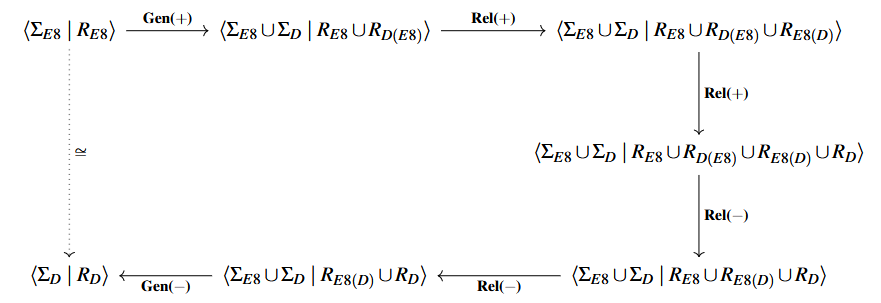

---

##### Download

+ [Paper](https://arxiv.org/pdf/2407.11152)

---

##### Abstract

 We give a sound and complete equational theory for 3-qubit quantum circuits over the Toffoli-Hadamard gate set { X, CX, CCX, H }.
 That is, we introduce a collection of true equations among Toffoli-Hadamard circuits on three qubits that is sufficient to derive any other true equation between such circuits.
 To obtain this equational theory, we first consider circuits over the Toffoli-K gate set { X, CX, CCX, K }, where K = HxH.
 The Toffoli-Hadamard and Toffoli-K gate sets appear similar, but they are crucially different on exactly three qubits.
 Indeed, in this case, the former generates an infinite group of operators, while the latter generates the finite group of automorphisms of the well-known E8 lattice.
 We take advantage of this fact, and of the theory of automorphism groups of lattices, to obtain a sound and complete collection of equations for Toffoli-K circuits.
 We then extend this equational theory to one for Toffoli-Hadamard circuits by leveraging prior work of Li et al. on Toffoli-Hadamard operators. 
  
---

##### Figure 2: A diagrammatic summary of the Tietze transformations used to obtain a presentation for W(E8). 



---

##### Citation

```latex
@article{MRS2024,
title     = {A Sound and Complete Equational Theory for 3-Qubit {Toffoli}-{Hadamard} Circuits},
volume    = {406},
doi       = {10.4204/eptcs.406.1},
journal   = {Electronic Proceedings in Theoretical Computer Science},
publisher = {Open Publishing Association},
author    = {Matthew Amy and Neil J. Ross and Scott Wesley},
year      = {2024},
month     = Aug,
pages     = {1--43}
}
```

##### Related material

+ [Presentation slides](slides.pdf)
+ [Codebase](https://github.com/meamy/tietze)
