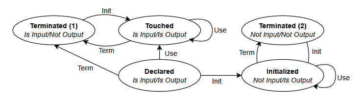

---

##### Download

+ [Paper](https://arxiv.org/pdf/2404.08147)

---

##### Abstract

 As quantum computing evolves, many important questions emerge, such as how best to represent quantum programs, and how to promote interoperability between quantum program analysis tools.
 These questions arise naturally in the design of quantum transpilers, which translate between quantum programming languages.
 In this paper, we take a step towards answering these questions by identifying challenges and best practices in quantum transpiler design.
 We base these recommendations on our experience designing LinguaQuanta, a quantum transpiler between Quipper and OpenQASM.
 First, we provide categorical specifications for quantum transpilers, which aim to encapsulate the core principles of the UNIX philosophy.
 We then identify quantum circuit decompositions which we expect to be useful in quantum transpilation.
 With these foundations in place, we then discuss challenges faced during the implementation of LinguaQuanta, such as ancilla management and stability under round translation.
 To show that LinguaQuanta works in practice, a short tutorial is given for the example of quantum phase estimation.
 We conclude with recommendations for the future of LinguaQuanta, and for quantum software development tools more broadly. 
 
---

##### Figure 4: A DFA to infer the state of a Quipper wire. The alphabet consists of Init, Term, and Use. Missing edges indicate one-way transitions to an error state.



---

##### Citation

```latex
@inproceedings{S2024,
author    = "Scott Wesley",
title     = "{LinguaQuanta}: Towards a Quantum Transpiler Between {OpenQASM} and {Quipper}",
booktitle = "Reversible Computation 16th International Conference, RC 2024, Toruń, Poland, July 4–5, 2024, Proceedings",
year      = "2024",
publisher = "Springer Nature Switzerland",
doi       = "10.1007/978-3-031-62076-8",
pages     = "142--160",
}
```

##### Related material

+ [Presentation slides](slides.pdf)
+ [Codebase](https://github.com/onestruggler/qasm-quipper)
+ [Application](https://arxiv.org/pdf/2311.10686)
