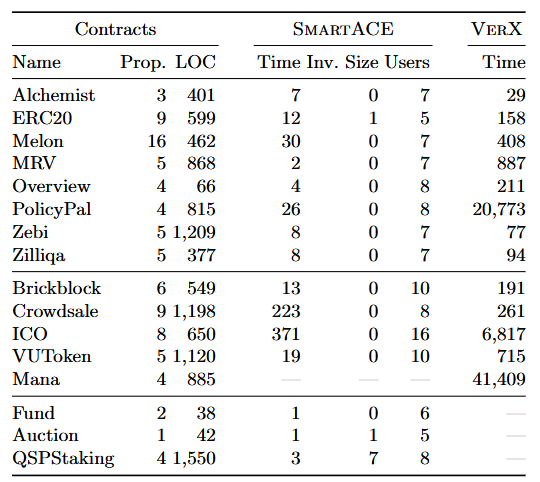

---

##### Download

+ [Paper](https://arxiv.org/pdf/2107.08583)

---

##### Abstract

Solidity smart contracts are programs that manage up to 2^160 users on a blockchain.
Verifying a smart contract relative to all users is intractable due to state explosion.
Existing solutions either restrict the number of users to under-approximate behaviour, or rely on manual proofs.
In this paper, we present local bundles that reduce contracts with arbitrarily many users to sequential programs with a few representative users.
Each representative user abstracts concrete users that are locally symmetric to each other relative to the contract and the property.
Our abstraction is semi-automated. The representatives depend on communication patterns, and are computed via static analysis.
A summary for the behaviour of each representative is provided manually, but a default summary is often sufficient.
Once obtained, a local bundle is amenable to sequential static analysis.
We show that local bundles are relatively complete for parameterized safety verification, under moderate assumptions.
We implement local bundle abstraction in SmartACE, and show order-of-magnitude speedups compared to a state-of-the-art verifier. 

---

##### Table 1: Experimental results for SmartACE. All reported times are in seconds.



---

##### Citation

```latex
@inproceedings{WCNTWG2021,
author    = {Scott Wesley and Maria Christakis and Jorge A. Navas and Richard Trefler and Valentin W\"{u}stholz and Arie Gurfinkel},
title     = {Compositional Verification of Smart Contracts Through Communication Abstraction},
booktitle = {Static Analysis: 28th International Symposium, SAS 2021, Chicago, IL, USA, October 17–19, 2021, Proceedings},
year      = {2021},
publisher = {Springer-Verlag},
doi       = {10.1007/978-3-030-88806-0_21},
pages     = {429--452},
}
```

---

##### Related material

+ [Presentation slides](slides.pdf)
+ [Non-technical summary](https://seahorn.github.io/smartace/verification/model%20checking/local%20reasoning/2020/07/17/local-reasoning-3.html)
+ [Codebase](https://github.com/contract-ace/smartace)
