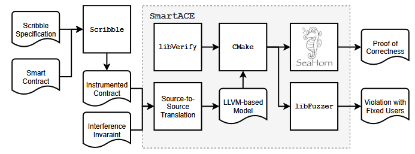

---

##### Download

+ [Paper](https://mariachris.github.io/Pubs/VMCAI-2022.pdf)

---

##### Abstract

Solidity smart contract allow developers to formalize financial agreements between users.
Due to their monetary nature, smart contracts have been the target of many high-profile attacks.
Brute-force verification of smart contracts that maintain data for up to 2^160 users is intractable.
In this paper, we present SmartACE, an automated framework for smart contract verification.
To ameliorate the state explosion induced by large numbers of users, SmartACE implements local bundle abstractions that reduce verification from arbitrarily many users to a few representative users.
To uncover deep bugs spanning multiple transactions, SmartACE employs a variety of techniques such as model checking, fuzzing, and symbolic execution.
To illustrate the effectiveness of SmartACE, we verify several contracts from the popular OpenZeppelin library: an access-control policy and an escrow service.
For each contract, we provide specifications in the Scribble language and apply fault injection to validate each specification.
We report on our experience integrating Scribble with SmartACE, and describe the performance of SmartACE on each specification.

---

##### Figure 3: The architecture of SmartACE for integration with SeaHorn for model checking and libFuzzer for greybox fuzzing.



---

##### Citation

```latex
@inproceedings{WCNTWG2022,
author    = {Scott Wesley and Maria Christakis and Jorge A. Navas and Richard Trefler and Valentin W\"{u}stholz and Arie Gurfinkel},
title     = {Verifying Solidity Smart Contracts via Communication Abstraction in SmartACE},
booktitle = {Verification, Model Checking, and Abstract Interpretation: 23rd International Conference, VMCAI 2022, Philadelphia, PA, USA, January 16–18, 2022, Proceedings},
year      = {2022},
publisher = {Springer-Verlag},
doi       = {10.1007/978-3-030-88806-0_21},
pages     = {425-449},
}
```

##### Related material

+ [Presentation slides](slides.pdf)
+ [Codebase](https://github.com/contract-ace/verify-openzeppelin)
